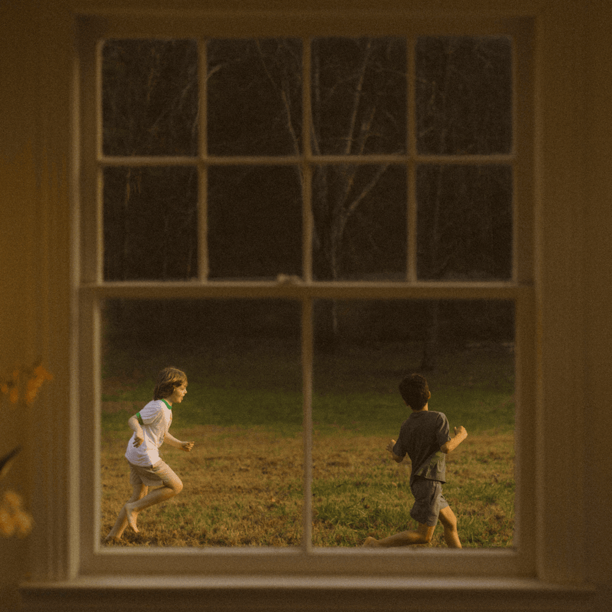
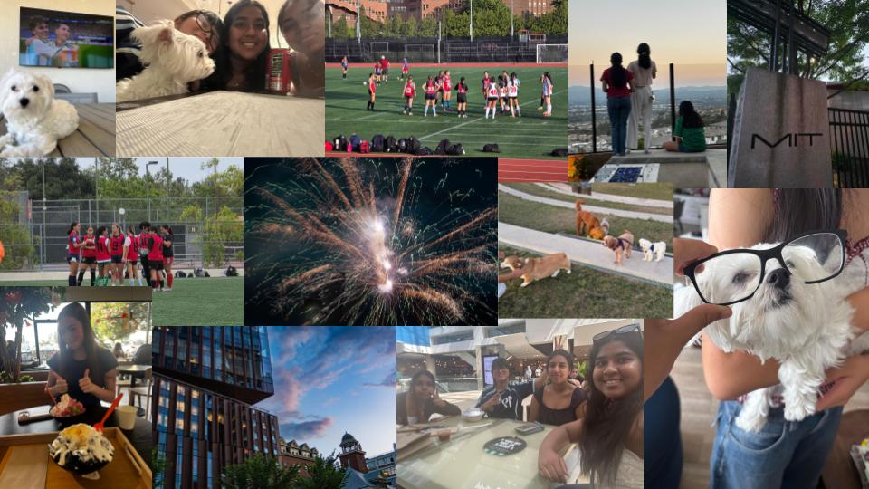

# **Letter to Mr. Aiello**
Dear Mr. Aiello,

I hope you are doing well and had a relaxing summer! Since we are going to spend the upcoming year together, I wanted to tell you a little bit about myself.

---
#### Education
My name is Haley Hyun and I'm currently a sophomore. I recently transfered after attending Sierra Canyon for my freshman year. Before high school, I went to Lawrence Middle School as many of my peers have. As for the future, I hope to go to college for mechanical engineering. My dream school is Massachusetts Institute of Technology (MIT). I took this class because I feel it will help me get one step closer to my goal.

---
#### Hobbies
In my freetime I like to do many things, both athletic and creative. Some of the activities I do in spare time are:

- Soccer
- Tennis
- Filmmaking
- Photography

Out of all the activities and participate in, sports takes up most of my time. Currently, I play varisty soccer and tennis for this school. Outside of school, I play club soccer at the ECNL-RL level with the LA Breakers. I mostly play winger or forward, although sometimes I play as a center attacking mid. My goal is to eventually play Division 3 at a high academic school for college. For tennis, I can play both singles and doubles, depending on where I'm needed. As much as I love soccer and it will always be my favorite sport, I think sometimes loving something too much can be harmful. There is a lot of pressure to play well, win trophies, make playoffs, etc... Tennis is more for fun, something I can play with no expectations. I feel as though it balances how much pressure I put on myself and lowers my stress from school and soccer.

To fulfill the more creative side of me, I do filmmaking and photography. I love being able to capture things in a moment and convey a message or story through my perspective. As of right now, I have won the Friend's Choice Award at UCLA for my film *Uninvited Guests* and will be attending the Calabasas Film Festival in September for my film *Cookie Monster*. Similar to film, I also do photography. I love taking sports photos, but nature is a close second. I'm looking to sign a contract this week or next with Sun Valley to take photos for their sports team. 

---
### Summer of 2026‼️

#### Movies

| | Movie | Director | Rating (⭐⭐⭐⭐⭐) | Thoughts |
| - | - | - | - | - |
| 1 | "The Odyssey" | Christopher Nolan | ⭐⭐⭐⭐⭐ | Cinematic masterpiece. His limited use of CGI really brought this film to life. It was a tad bit loud and I disliked how it strayed from the original story, but overall will probably win Best Picture at the Oscars this year. |
| 2 | "Spider-Man: Brand New Day" | Destin Daniel Cretton | ⭐⭐⭐⭐ | Had a great plot, but visually wasn't as great as the Odyssey. At times it felt predictable what was going to happen, and the post-production could've been better. Tom Holland had a great performance!
| 3 | "Beautiful Boy" | Felix Van Groeningen | ⭐⭐⭐⭐⭐⭐ | This is my favorite movie of all time and definitely broke the rating scale. It isn't one I watched over the summer, but it is so good I **had** to include it on this list. It's the kind of movie you can only watch once and I don't say that lightly.

#### Music

As you will quickly learn after looking at my playlist, I am a <u> **HUGE**</u> Noah Kahan fan. Unfortunately, I did not get tickets to his concert, but his album has been on repeat this entire summer. Instead of pasting this link to his album, which is all I listened to, I included some other songs I still really like:

[Here is my spotify playlist of the summer!](https://open.spotify.com/playlist/7FiPhAqPAoCAfKnsezALJ4?si=3129f985e23545a7)

If you have the chance, I highly reccomend his new album *The Great Divide*. even if that is not your taste, he still has more albums such as *Busyhead* and *Stick Season*. Any song with him in it is amazing and I fully expect him to sweep the Grammys this year.

#### Collage

These are a bunch of pictures of hanging out with friends, watching the world cup, chilling with my dog, and playing soccer (in and out of state). It is mostly what my summer consistented of besides summer school. If you have any questions, feel free to ask!

---

That is a little about me and I hope you learned something you didn't know before. As the school year progresses, I hope to get to know you better. Have a great day and thank you for your time.

Sincerely,

Haley Hyun